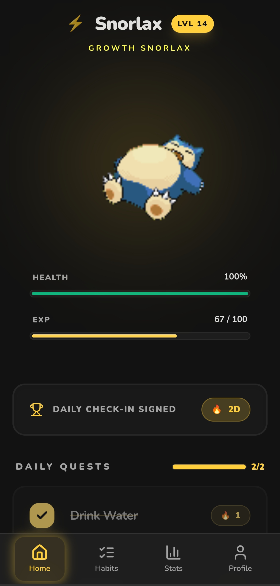
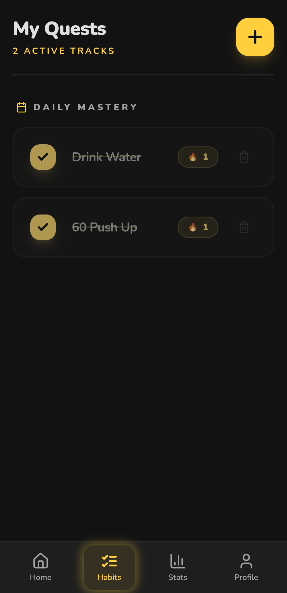
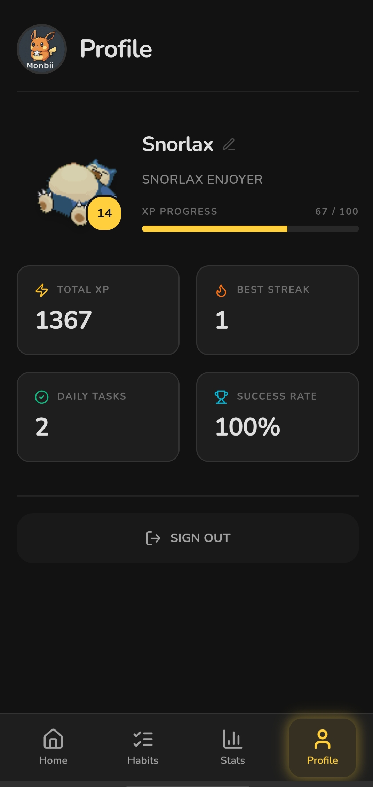
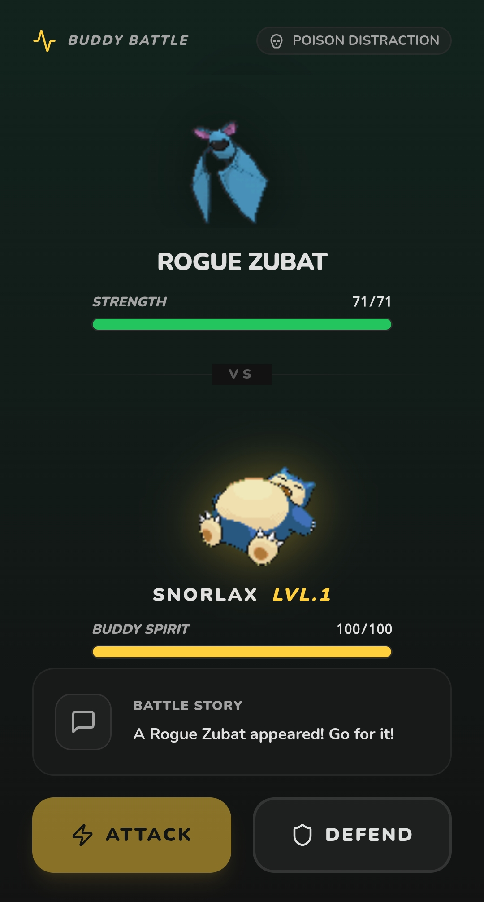
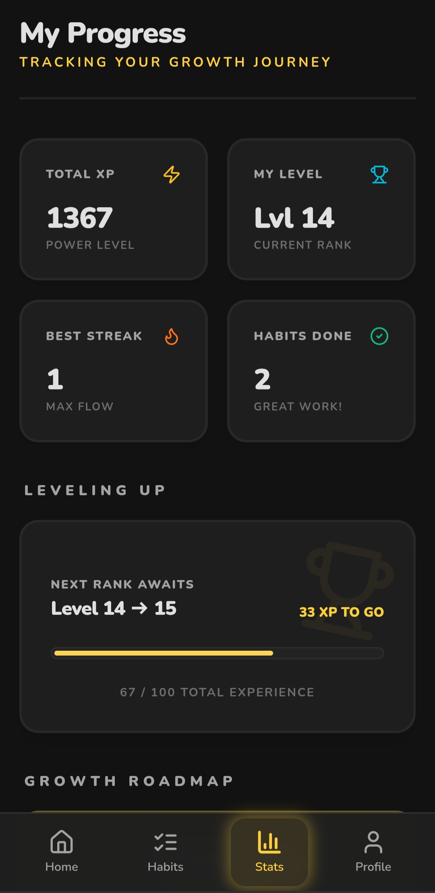

#  Monbii

**A minimalist habit app where your companion grows with your consistency.**

> Source code is private. This repository showcases the product, system design, and technical decisions behind Monbii.

---

## Live Demo

[**monbii.vercel.app →**](https://monbii.vercel.app/)

---

## Preview

| Home | Habits | Companion | Battle | Stats |
|------|--------|-----------|--------|-------|
|  |  |  |  |  |

---

## What is Monbii?

Most habit apps reduce consistency to numbers.

Monbii turns it into a feedback system.

Your companion reflects your behavior in real time:
- stay consistent → it grows and evolves  
- miss habits → it reacts and weakens  

The goal is simple:  
**make habits feel alive instead of mechanical.**

---

## Core Loop

1. Set habits that matter  
2. Complete them → gain progression  
3. Companion evolves based on consistency  
4. Miss habits → visible negative feedback  
5. Periodic battles reflect your real performance  

---

## Features

- Companion system — evolves based on your streak and behavior  
- Habit tracking — fast, low-friction daily interactions  
- Progression & evolution — visible growth over time  
- Battle system — performance-based engagement loop  
- Stats dashboard — tracks consistency and progression  
- Smart notifications — contextual, not spammy  

More in [`docs/features.md`](./docs/features.md)

---

## Tech Stack

| Layer | Technology |
|---|---|
| Frontend | React + Capacitor |
| State | Zustand |
| Backend | Supabase / Lovable Cloud |
| Animation | Lottie |

Architecture: [`docs/architecture.md`](./docs/architecture.md)

---

## Documentation

- [`docs/overview.md`](./docs/overview.md) — problem & behavioral design  
- [`docs/architecture.md`](./docs/architecture.md) — system design  
- [`docs/features.md`](./docs/features.md) — features  
- [`docs/roadmap.md`](./docs/roadmap.md) — upcoming work  

---

## Notes

This is a product showcase repository.

The full source code is intentionally private.

---

## License

All Rights Reserved.
